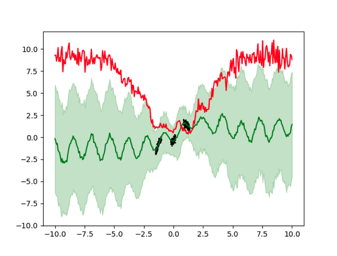

# UncertaintyFlow



## Installation

Clone this repo.
```bash
git@github.com:a07458666/UncertaintyFlow.git
cd UncertaintyFlow/
```

This code requires PyTorch, TensorFlow, Torchdiffeq and Python 3+. Please install dependencies by
```bash
pip install -r requirements.txt
```

## Config
```yaml
# config.yaml
output_folder: "output_folder"

# my_1d, wiggle, matern, andrew, agw, origin, axis
dataset: "my_1d"
remark: ""
condition_scale: 1
position_encoding: True
position_encoding_m: 3

# train
batch: 5
epochs: 40
flow_modules: '32-32-32-32-32'
cond_size: 1
lr: 1.0e-3
inputDim: 1
add_uniform: True
uniform_rate: 0.1
uniform_scale: 1.2
# eval
sample_count: 100
eval_data:
  count: 300
  max: 3.0
  min: -3.0
```

## Train Flow

```bash
python train_flow.py --config <config_path>
```

## Test Flow(visualize)

The result(.png) will be output in model_path.
```bash

python test_flow.py --modelPath <modelPath>
```